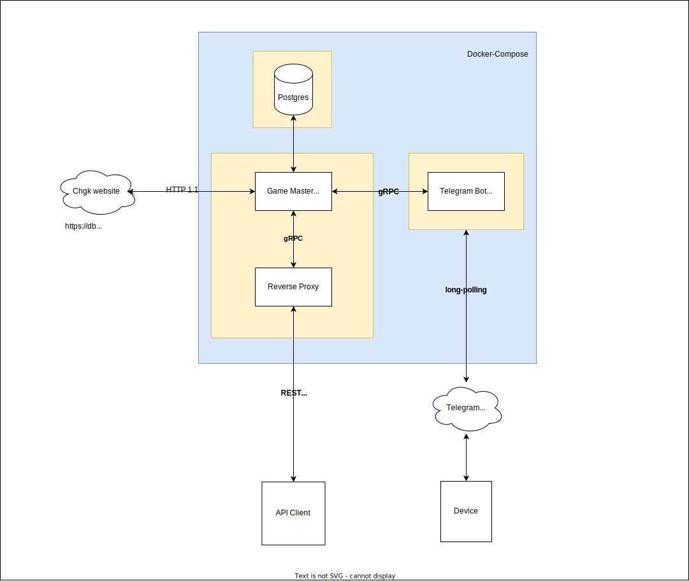
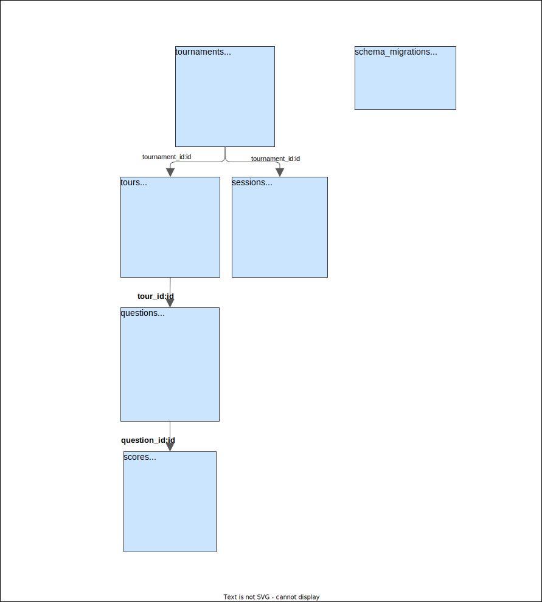

# homework-2

## Задание

Цель домашнего задания №2 научиться работать с внешними системами, делать свои эндпоинды (хендлеры, ручки) для сервисов, хранить данные, обрабатывать запросы многопоточно. 
И, разумеется, прикрутить взаимодействие с вашим сервисом через мессенджер с хорошим API.
В рамках первой части ДЗ вам потребуется сделать Implementation Concept того, как должен работать сервис, который вы разработаете.
Вам требуется уточнить формальные требования, составить план максимум и сформировать по нему некоторое MVP, которое удовлетворяет указанным ниже требованиям:
1. Сервис должен предоставлять gRPC интерфейс
2. Сервис должен предоставлять HTTP интерфейс как прокси к gRPC интерфейсу (через grpc-gateway).
3. Интерфейс бота, используемый в мессенджере, должен быть продублирован через gRPC/HTTP ручки.
4. Код должен быть покрыт тестами, с использованием моков
5. Сервис должен использовать миграции при работе с БД
6. С сервисом можно взаимодействовать через интерфейс какого-либо мессенджера (в приоритете Mattermost и Telegram)
7. Сервис должен хранить конфигурацию в yaml файлах
8. Сервис должен быть завёрнут в докер.

Ваша цель — за эту неделю (до четверга) предоставить концепт и согласовать его до начала майских.

Вы можете описать предложение в любой форме (markdown, miro, mermaid) главное:

1. Создаёте у себя проект homework-2
2. Создайте в нём файл README.md, в котором опишите, что планируете делать и скиньте ссылку на MR этого файла тьютору.
На реализацию задуманного у вас будет время до 16 мая.

----
## Implementation Concept

Я раньше много играл в ЧГК, так что выбор бота был очевиден.

### ЧГК Бот:
* Смотрит участников в чате.
* Отделяет ботов от людей.
* Регистрирует чат в БД.
* Регистрирует участников в БД.
* Парсит [базу чгк](https://db.chgk.info/) для поиска пакетов с вопросами.
* Парсит xml версии пакетов.
* Запоминает какие пакеты играл участник.
* Не позволяет играть в уже сыгранные пакеты.
* Формирует рейтинг участиников.
* Использует [сходство Джаро](https://ru.wikipedia.org/wiki/%D0%A1%D1%85%D0%BE%D0%B4%D1%81%D1%82%D0%B2%D0%BE_%D0%94%D0%B6%D0%B0%D1%80%D0%BE_%E2%80%94_%D0%92%D0%B8%D0%BD%D0%BA%D0%BB%D0%B5%D1%80%D0%B0) для проверки ответа.
* Создает сессии (репрезентация игры).
* Хранит сессии в БД.
* Не позволяет иметь больше одной активной сессии на чат.
* Запускается через docker-compose (как и БД).
* Использует grpc-gateway для генерации Swagger к API.

### Интерфейс бота:
    /start - запуск бота
    /stop - остановить бота
    /search - найти нужный пакет
    /random - запустить рандомный пакет
    /go - начинает сессию
    /pause - приостанавливает сессию
    /score - рейтинг участников
    /submit - отправить ответ на проверку


-----

## Implementation

По итогу, немного отошел от изначальной задумки. Где-то у телеграма ограниченный фукнционал, где-то еще что.
<br>
Обновленная схема выглядит вот так:



 Оставил long-polling при взаимодейтсвии с API телеграма. 
 При webhook механизме пришлось бы генерировать самоподписанные сертификаты, 
 все это регистрировать у BotFather телеграма и прочие танцы с бубном.
 
При long-polling механизме нужен только ключ бота.
На деле задержки не заметны.

#### Game-Master Service

В этом сервисе нет ограничений по времени (все временные ограничения реализованы внутри бота). 
Сервис парсит данные с сайта ЧГК.
Как только начинается игра, он сохраняет все вопросы турнира в базу данных 
делая игру независимой от сайта.

Есть моки сгенерированные через minimock.

```protobuf
service Chgk {
  rpc HealthCheck(Ping) returns (Pong);

  rpc ReadTournament(TournamentRequest) returns (Tournament);
  rpc ReadQuestion(QuestionRequest) returns (Question);
  rpc ReadAnswer(AnswerRequest) returns (Answer);
  rpc ReadScore(ScoreRequest) returns (Score);
  rpc RandomTournaments(RandomRequest) returns (RandomResponse);

  rpc Begin(GameRequest) returns (GameResponse);
  rpc Submit(Guess) returns (GuessResponse);
  rpc Finish(StopRequest) returns (StopResponse);
}
```

#### Database

Для базы данных используется Postgres. Для миграций go-migrate.

Схема ниже:



#### Telegram Bot Service

Тут реализовано взаимодействие с API телеграма. 
В оперативной памяти хранятся начатые сессии и ведется отчет времени на вопросы.
Кроме этого логики никакой нет, только своевременный вызов методов у сервиса Game Master.

В конфиге telegram-bot нужно добавить API key бота.
Docker-compose скачивает зависимости долговато - 14 минут.

----

`gRPC` доступен по хосту: `localhost:8080`
<br>
`http-gateway` доступен по хосту: `localhost:8000/api/v1/`